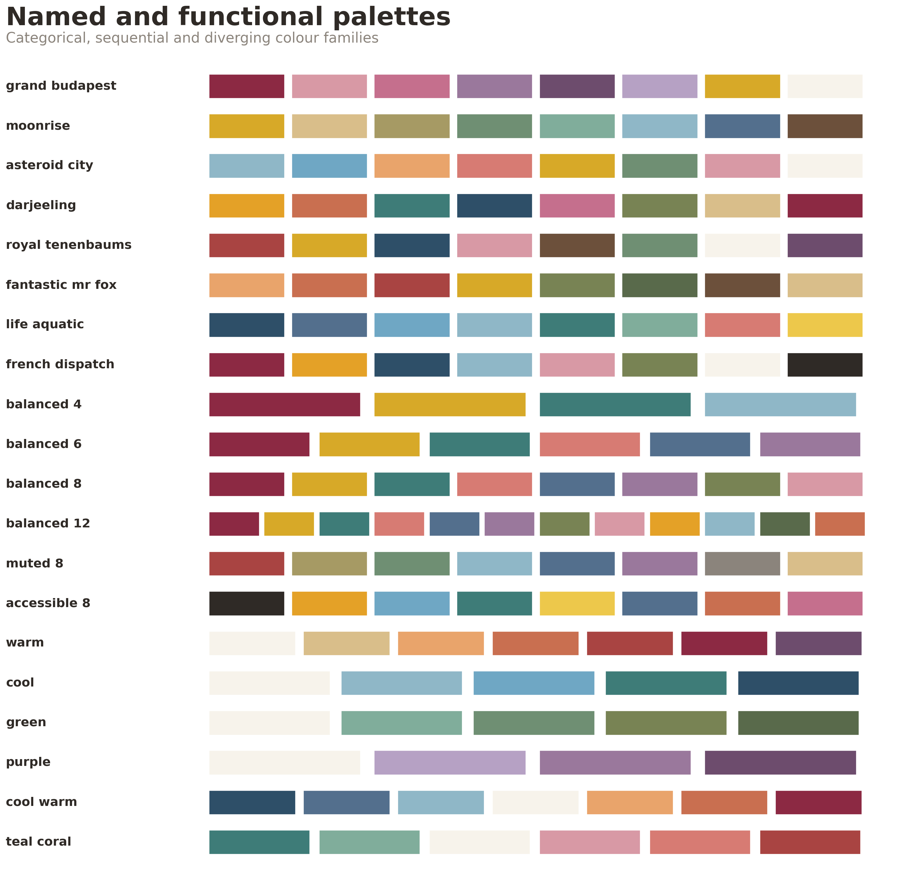

# Pascoe Plot Style

A publication-focused styling toolkit for scientific figures, with a broad master colour library, reusable categorical and continuous palettes, semantic project presets, and consistent vector-first export.

The repository separates three things that are often mixed together:

1. **Figure styling** — typography, axes, spacing, legends, panels and export.
2. **General colour palettes** — reusable schemes for arbitrary categorical or continuous data.
3. **Scientific presets** — stable category-to-colour mappings for a particular analysis or manuscript.

This keeps the package organism-agnostic while allowing project-specific examples such as *Acinetobacter* and *Campylobacter coli*.



Additional references: [master colour library](docs/master_colour_reference.png) and [scientific presets](docs/preset_reference.png).

## Included

```text
pascoe-plot-style/
├── data/                       # canonical language-neutral JSON definitions
│   ├── master.json
│   ├── palettes.json
│   └── presets.json
├── src/pascoe_plot_style/      # installable Python package
├── R/                           # ggplot2 theme plus generated palette data
├── examples/                   # general and project-specific examples
├── scripts/                    # figure template, data sync and reference generator
├── docs/                       # generated visual palette references
├── STYLE_GUIDE.md
└── PROMPT_TEMPLATE.md
```

## Python installation

```bash
python -m pip install -e .
```

### Apply the core style

```python
import matplotlib.pyplot as plt
from pascoe_plot_style import apply_style, save_figure, style_axes

apply_style("paper", palette="balanced_8")

fig, ax = plt.subplots(figsize=(7.2, 4.8))
ax.plot([1, 2, 3, 4], [2.0, 3.6, 3.1, 5.2], marker="o")
ax.set(title="Descriptive title", xlabel="Sampling point", ylabel="Measured value")
style_axes(ax, grid="y")
save_figure(fig, "outputs/example")
```

### Use a named palette

```python
from pascoe_plot_style import get_palette

colours = get_palette("moonrise")
colours = get_palette("asteroid_city", n=5)
```

Available named examples include:

- `grand_budapest`
- `moonrise`
- `asteroid_city`
- `darjeeling`
- `royal_tenenbaums`
- `fantastic_mr_fox`
- `life_aquatic`
- `french_dispatch`

The neutral defaults are `balanced_4`, `balanced_6`, `balanced_8`, `balanced_12`, `muted_8`, and `accessible_8`.

### Continuous palettes

```python
from pascoe_plot_style import get_palette, make_colormap

hex_colours = get_palette("cool_warm", n=11)
cmap = make_colormap("warm")
```

Sequential palettes: `warm`, `cool`, `green`, `purple`, `neutral`.

Diverging palettes: `cool_warm`, `teal_coral`, `purple_green`.

### Scientific presets

```python
from pascoe_plot_style import get_preset, preset_colour

source_colours = get_preset("source_attribution")
acinetobacter = get_preset("acinetobacter.lineage")
ccoli = get_preset("campylobacter_coli.lineage")

st1150_colour = preset_colour("ST-1150 complex", "campylobacter_coli.lineage")
```

Included worked presets:

- `source_attribution`
- `amr_phenotype`
- `acinetobacter.lineage`
- `acinetobacter.carbapenem`
- `acinetobacter.architecture`
- `campylobacter_coli.lineage`
- `campylobacter_coli.clinical_status`
- `campylobacter_coli.host`

Project presets reference names from `master.json`; they do not maintain a second set of unrelated hex codes.

## Matplotlib style sheet

```python
import matplotlib.pyplot as plt
from importlib.resources import files

style_file = files("pascoe_plot_style.mplstyles").joinpath("pascoe.mplstyle")
plt.style.use(style_file)
```

The Python helper is preferred because it also supplies palettes, presets, panel labels, sizing and export functions.

## R / ggplot2

```r
source("R/pascoe_theme.R")

p <- ggplot(df, aes(lineage, percent, fill=lineage)) +
  geom_col() +
  scale_fill_pascoe_preset("campylobacter_coli_lineage") +
  theme_pascoe(grid="y")

save_pascoe_plot(p, "outputs/lineages")
```

## Contexts

```python
apply_style("paper")
apply_style("presentation")
apply_style("poster")
```

## Generate examples and references

```bash
python examples/python_general.py
python examples/acinetobacter_example.py
python examples/campylobacter_coli_example.py
python scripts/make_palette_reference.py
```

## Editing palette data

Edit the canonical files in `data/`, then run:

```bash
python scripts/sync_palette_data.py
```

This copies them into the installable Python package and regenerates `R/pascoe_data.R`. Tests confirm that the canonical and packaged JSON remain identical.

## Tests

```bash
python -m pytest
```

## Licence

MIT. Reuse and adapt it freely.
